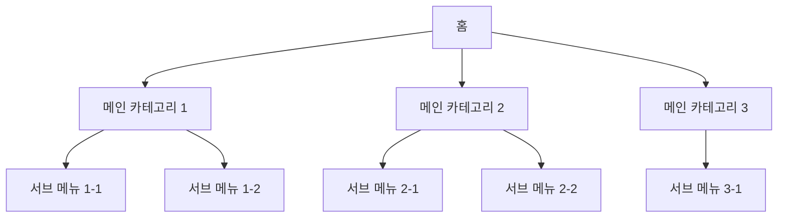

# <% tp.file.cursor(2) %> 정보 구조 (IA)

## 1. 개요

| 항목 | 내용 |
|------|------|
| 서비스명 | |
| 플랫폼 | Web / Mobile / Both |
| 최대 Depth | |
| 총 화면 수 | |
| 작성 기준일 | <% tp.date.now('YYYY-MM-DD') %> |

---

## 2. 사이트맵

---

## 3. 화면 목록

| 화면 ID | 화면명 | Depth | 상위 화면 | 접근 권한 | 상태 |
|---------|--------|-------|----------|-----------|------|
| SCR-001 | | 1 | - | 전체 | Draft |
| SCR-002 | | 2 | SCR-001 | 로그인 | Draft |
| SCR-003 | | 2 | SCR-001 | 관리자 | Draft |

---

## 4. 네비게이션 패턴

### GNB (Global Navigation Bar)
| 순서 | 메뉴명 | 링크 | 아이콘 | 하위메뉴 |
|------|--------|------|--------|----------|
| 1 | | | | |
| 2 | | | | |
| 3 | | | | |

### LNB (Local Navigation Bar)
| 상위 메뉴 | 순서 | 서브 메뉴명 | 링크 |
|-----------|------|------------|------|
| | 1 | | |
| | 2 | | |

### 탭 네비게이션
| 화면 | 탭 순서 | 탭명 | 기본 선택 |
|------|---------|------|-----------|
| | 1 | | Y |
| | 2 | | N |

### 브레드크럼
| 화면 | 경로 |
|------|------|
| SCR-001 | 홈 |
| SCR-002 | 홈 > 카테고리 > 상세 |

---

## 5. 권한별 메뉴 접근

| 메뉴 | 비로그인 | 일반 사용자 | 매니저 | 관리자 | 슈퍼관리자 |
|------|----------|------------|--------|--------|-----------|
| 홈 | O | O | O | O | O |
| 대시보드 | X | O | O | O | O |
| 회원 관리 | X | X | O | O | O |
| 시스템 설정 | X | X | X | X | O |

> **범례**: O = 접근 가능, X = 접근 불가, △ = 조건부 접근

---

## 6. 검색 구조

### 검색 범위
| 검색 대상 | 검색 필드 | 필터 옵션 | 정렬 옵션 |
|-----------|-----------|-----------|-----------|
| | | | |
| | | | |

### 검색 결과 표시
| 항목 | 설정 |
|------|------|
| 기본 정렬 | |
| 페이지당 표시 수 | |
| 무한 스크롤 / 페이지네이션 | |
| 검색어 하이라이트 | Y / N |

---

## 7. URL 설계

| 화면 | URL 패턴 | 파라미터 | 비고 |
|------|----------|----------|------|
| 홈 | / | - | |
| 목록 | /items | ?page=&sort= | |
| 상세 | /items/:id | id: number | |
| 생성 | /items/new | - | |
| 수정 | /items/:id/edit | id: number | |

---

## 8. 비고

<!-- 추가 참고사항, IA 변경 이력, 논의 필요 사항 등 -->
