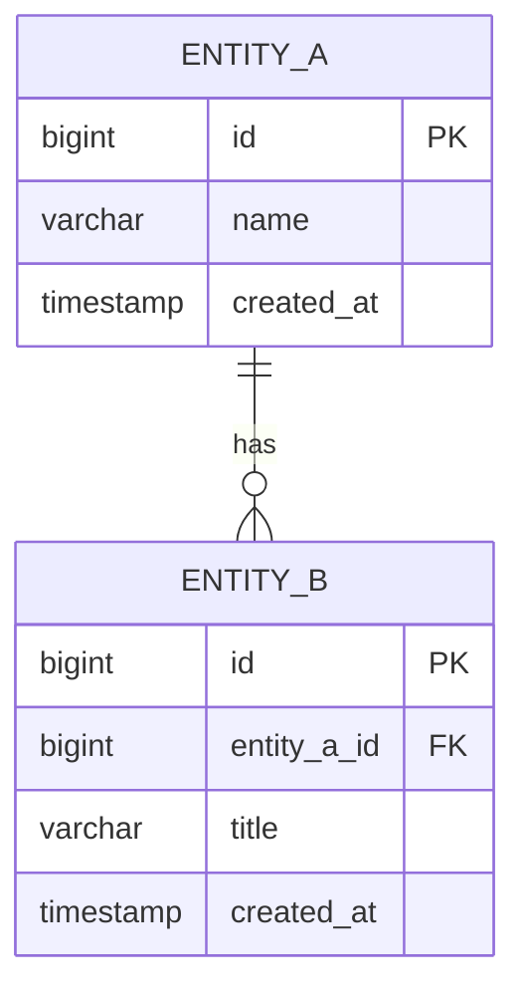

# <% tp.file.cursor(2) %> 데이터 정의서

## 1. 엔티티 개요

| 항목 | 내용 |
|------|------|
| 엔티티명 | |
| 테이블명 | |
| 설명 | |
| 모듈 | |
| 총 필드 수 | |

---

## 2. 필드 정의

| 필드명 | DB 컬럼 | 타입 | 필수 | 기본값 | 설명 | 제약 조건 | 인덱스 |
|--------|---------|------|------|--------|------|----------|--------|
| id | id | BIGINT | Y | AUTO_INCREMENT | PK | UNIQUE | PK |
| | | VARCHAR(255) | Y | | | | |
| | | TEXT | N | NULL | | | |
| | | INTEGER | N | 0 | | CHECK(>=0) | |
| | | BOOLEAN | N | false | | | |
| | | TIMESTAMP | N | NULL | | | |
| createdAt | created_at | TIMESTAMP | Y | CURRENT_TIMESTAMP | 생성일시 | | |
| updatedAt | updated_at | TIMESTAMP | Y | CURRENT_TIMESTAMP | 수정일시 | | |
| deletedAt | deleted_at | TIMESTAMP | N | NULL | 삭제일시 (Soft Delete) | | IDX |

---

## 3. 관계

| 대상 엔티티 | 관계 타입 | FK | 설명 |
|-------------|----------|-----|------|
| | 1:N | _id | |
| | N:1 | _id | |
| | M:N | (중간 테이블) | |
| | 1:1 | _id | |

---

## 4. ERD



---

## 5. Enum 정의

### [Enum명 1]
| 값 | 라벨 | 설명 |
|----|------|------|
| ACTIVE | 활성 | |
| INACTIVE | 비활성 | |
| DELETED | 삭제됨 | |

### [Enum명 2]
| 값 | 라벨 | 설명 |
|----|------|------|
| | | |
| | | |

---

## 6. 인덱스 정의

| 인덱스명 | 컬럼 | 타입 | 용도 |
|----------|------|------|------|
| PK_entity_id | id | PRIMARY KEY | PK |
| IDX_entity_status | status | BTREE | 상태별 조회 |
| IDX_entity_created | created_at | BTREE | 날짜별 정렬 |
| UNQ_entity_code | code | UNIQUE | 코드 중복 방지 |
| IDX_entity_search | name, status | COMPOSITE | 검색 최적화 |

---

## 7. 시드 데이터

| id | 필드1 | 필드2 | 설명 |
|----|-------|-------|------|
| 1 | | | 초기 데이터 |
| 2 | | | 초기 데이터 |

---

## 8. 마이그레이션 노트

### 생성 (v0.1.0)
```sql
-- 테이블 생성 SQL 예시
CREATE TABLE entity_name (
  id BIGSERIAL PRIMARY KEY,
  -- 필드 정의
  created_at TIMESTAMP NOT NULL DEFAULT CURRENT_TIMESTAMP,
  updated_at TIMESTAMP NOT NULL DEFAULT CURRENT_TIMESTAMP,
  deleted_at TIMESTAMP
);
```

### 변경 이력
| 버전 | 날짜 | 변경 내용 | 마이그레이션 |
|------|------|----------|-------------|
| 0.1.0 | <% tp.date.now('YYYY-MM-DD') %> | 최초 생성 | CREATE TABLE |

---

## 9. 관련 문서

- API 명세서: [[API-]]
- 기능명세서: [[FNC-]]
- 상태 전이도: [[STT-]]
