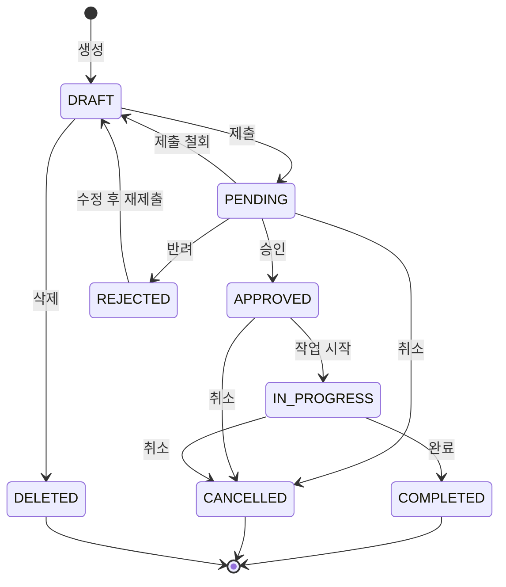

# <% tp.file.cursor(2) %> 상태 전이도

## 1. 대상 엔티티 정보

| 항목 | 내용 |
|------|------|
| 엔티티명 | |
| 상태 필드명 | status |
| 총 상태 수 | |
| 초기 상태 | DRAFT |
| 최종 상태 | COMPLETED / DELETED |

---

## 2. 상태 정의

| 상태값 | 상태명 | 설명 | 표시 색상 |
|--------|--------|------|----------|
| DRAFT | 초안 | 작성 중, 아직 제출되지 않은 상태 | `#94A3B8` (Gray) |
| PENDING | 대기 | 제출됨, 검토/승인 대기 중 | `#3B82F6` (Blue) |
| IN_PROGRESS | 진행 중 | 처리/작업이 진행 중인 상태 | `#8B5CF6` (Purple) |
| APPROVED | 승인됨 | 검토 완료, 승인된 상태 | `#10B981` (Green) |
| REJECTED | 반려됨 | 검토 후 반려된 상태 | `#EF4444` (Red) |
| COMPLETED | 완료 | 모든 처리가 완료된 최종 상태 | `#059669` (Dark Green) |
| CANCELLED | 취소됨 | 사용자에 의해 취소된 상태 | `#6B7280` (Dark Gray) |
| DELETED | 삭제됨 | Soft Delete 상태 | `#DC2626` (Dark Red) |

---

## 3. 상태 전이 다이어그램



---

## 4. 전이 규칙

| 현재 상태 | 이벤트 | 다음 상태 | 조건 | 필요 권한 | 사이드 이펙트 |
|-----------|--------|----------|------|----------|-------------|
| DRAFT | 제출 | PENDING | 필수 필드 완성 | USER+ | 알림 발송 (검토자) |
| DRAFT | 삭제 | DELETED | - | 작성자/ADMIN | Soft Delete |
| PENDING | 승인 | APPROVED | - | MANAGER+ | 알림 발송 (작성자) |
| PENDING | 반려 | REJECTED | 반려 사유 필수 | MANAGER+ | 알림 발송 (작성자) |
| PENDING | 취소 | CANCELLED | - | 작성자/ADMIN | - |
| PENDING | 제출 철회 | DRAFT | - | 작성자 | - |
| APPROVED | 작업 시작 | IN_PROGRESS | - | 담당자+ | - |
| APPROVED | 취소 | CANCELLED | 취소 사유 필수 | ADMIN+ | 관련 작업 중단 |
| REJECTED | 수정 후 재제출 | DRAFT | - | 작성자 | 버전 증가 |
| IN_PROGRESS | 완료 | COMPLETED | 완료 조건 충족 | 담당자+ | 이력 기록 |
| IN_PROGRESS | 취소 | CANCELLED | 취소 사유 필수 | ADMIN+ | 진행 작업 롤백 |

---

## 5. 자동 전이

| 조건 | 현재 상태 | 다음 상태 | 트리거 타이밍 |
|------|----------|----------|-------------|
| PENDING 상태 7일 초과 | PENDING | DRAFT | 매일 00:00 배치 |
| 승인 후 30일 미처리 | APPROVED | CANCELLED | 매일 00:00 배치 |
| Soft Delete 후 90일 | DELETED | (Hard Delete) | 매주 일요일 배치 |

---

## 6. 제약 조건 (불가능한 전이)

| 현재 상태 | 불가능한 전이 | 사유 |
|-----------|-------------|------|
| COMPLETED | → 모든 상태 | 완료 후 되돌릴 수 없음 |
| CANCELLED | → 모든 상태 | 취소 후 복원 불가 |
| DELETED | → 모든 상태 | 삭제 후 복원은 별도 프로세스 |
| DRAFT | → APPROVED | 검토 과정 필수 |
| DRAFT | → IN_PROGRESS | 승인 과정 필수 |

---

## 7. 이력 관리

### 상태 변경 로그 형식
```json
{
  "entity_id": 1,
  "entity_type": "",
  "from_status": "PENDING",
  "to_status": "APPROVED",
  "changed_by": "user_id",
  "changed_at": "2026-01-01T00:00:00.000Z",
  "reason": "승인 사유",
  "metadata": {}
}
```

### 로그 보관 정책
| 항목 | 정책 |
|------|------|
| 보관 기간 | 3년 |
| 저장 위치 | status_history 테이블 |
| 조회 권한 | MANAGER+ |
| 삭제 가능 여부 | 불가 (감사 추적용) |

---

## 8. 관련 문서

- 기능명세서: [[FNC-]]
- 데이터 정의서: [[DAT-]]
- 에러 코드 정의서: [[ERR-]]
