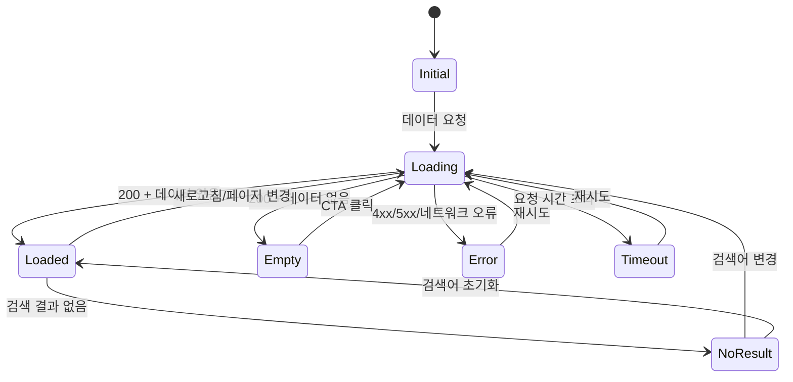

# <% tp.file.cursor(2) %> 상태별 화면 정의

## 1. 대상 화면 정보

| 항목 | 내용 |
|------|------|
| 대상 화면 | [[SCR-xxx]] |
| 화면명 | |
| 플랫폼 | Web / Mobile / Both |
| 총 상태 수 | |

---

## 2. 상태 매트릭스

| 상태 | 조건 | 헤더 | 본문 영역 | 하단 영역 | CTA | 토스트 메시지 |
|------|------|------|----------|----------|-----|-------------|
| Initial | 최초 진입 | 기본 헤더 | - | - | - | - |
| Loading | 데이터 요청 중 | 기본 헤더 | 스켈레톤 UI | 숨김 | 비활성 | - |
| Loaded | 데이터 1건 이상 | 기본 헤더 | 데이터 목록 | 페이지네이션 | 활성 | - |
| Empty | 데이터 0건 | 기본 헤더 | 빈 상태 일러스트 | 숨김 | 데이터 추가 | - |
| Error (네트워크) | 네트워크 끊김 | 기본 헤더 | 네트워크 에러 UI | 숨김 | 재시도 | "네트워크 연결을 확인해주세요" |
| Error (서버) | 5xx 응답 | 기본 헤더 | 서버 에러 UI | 숨김 | 홈으로 | "일시적인 오류가 발생했습니다" |
| Error (권한) | 403 응답 | 기본 헤더 | 권한 없음 UI | 숨김 | 이전으로 | "접근 권한이 없습니다" |
| NoResult | 검색 결과 0건 | 검색바 유지 | 검색 결과 없음 UI | 숨김 | 검색어 초기화 | - |
| Forbidden | 인증 미달 | 최소 헤더 | 접근 불가 UI | 숨김 | 로그인 | - |
| Timeout | 요청 시간 초과 | 기본 헤더 | 타임아웃 UI | 숨김 | 재시도 | "요청 시간이 초과되었습니다" |
| Offline | 오프라인 모드 | 오프라인 배너 | 캐시 데이터 | 숨김 | - | "오프라인 상태입니다" |

---

## 3. 각 상태별 상세 정의

### Initial (초기)
| 항목 | 내용 |
|------|------|
| 진입 조건 | 화면 최초 접근 |
| 화면 구성 | |
| 사용자 액션 가능 여부 | 제한적 |
| 자동 전환 조건 | 데이터 요청 시작 → Loading |

### Loading (로딩)
| 항목 | 내용 |
|------|------|
| 진입 조건 | API 호출 시작 |
| 화면 구성 | 스켈레톤 UI (콘텐츠 영역) |
| 사용자 액션 가능 여부 | 불가 (버튼 비활성) |
| 자동 전환 조건 | 응답 수신 → Loaded/Empty/Error |

### Loaded (데이터 있음)
| 항목 | 내용 |
|------|------|
| 진입 조건 | 200 응답 + 데이터 1건 이상 |
| 화면 구성 | 전체 UI 정상 표시 |
| 사용자 액션 가능 여부 | 모든 액션 가능 |
| 자동 전환 조건 | - |

### Empty (빈 상태)
| 항목 | 내용 |
|------|------|
| 진입 조건 | 200 응답 + 데이터 0건 |
| 화면 구성 | 일러스트 + 안내 문구 + CTA |
| 사용자 액션 가능 여부 | CTA만 가능 |
| 자동 전환 조건 | - |

### Error (에러)
| 항목 | 내용 |
|------|------|
| 진입 조건 | 4xx/5xx 응답 또는 네트워크 오류 |
| 화면 구성 | 에러 유형별 일러스트 + 메시지 + CTA |
| 사용자 액션 가능 여부 | CTA만 가능 |
| 자동 전환 조건 | 재시도 → Loading |

### NoResult (검색 결과 없음)
| 항목 | 내용 |
|------|------|
| 진입 조건 | 검색 200 응답 + 결과 0건 |
| 화면 구성 | 검색바 유지 + 결과 없음 안내 + 추천 키워드 |
| 사용자 액션 가능 여부 | 검색어 수정 가능 |
| 자동 전환 조건 | - |

---

## 4. 상태 전환 다이어그램

---

## 5. 에러 메시지 목록

| 상태 | 메시지 | CTA 텍스트 | CTA 동작 |
|------|--------|-----------|----------|
| Error (네트워크) | 네트워크 연결을 확인해주세요. | 다시 시도 | 재요청 |
| Error (서버) | 일시적인 오류가 발생했습니다. 잠시 후 다시 시도해주세요. | 홈으로 가기 | 홈 이동 |
| Error (권한) | 이 페이지에 접근할 권한이 없습니다. | 이전으로 | history.back |
| Forbidden | 로그인이 필요한 서비스입니다. | 로그인하기 | 로그인 페이지 |
| Timeout | 요청 시간이 초과되었습니다. | 다시 시도 | 재요청 |
| NoResult | '{검색어}'에 대한 검색 결과가 없습니다. | 전체 보기 | 검색어 초기화 |
| Empty | 아직 등록된 데이터가 없습니다. | 새로 만들기 | 생성 화면 이동 |

---

## 6. 비고

<!-- 추가 참고사항, 디자이너 협의 필요 사항 -->
