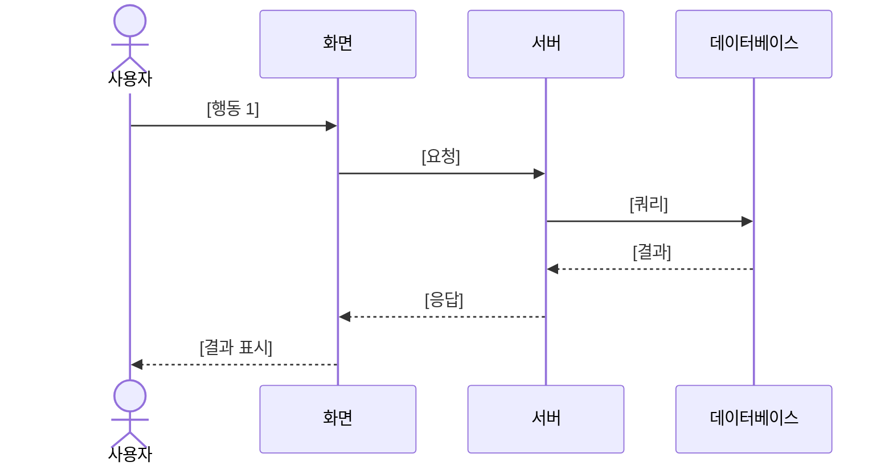

# <% tp.file.cursor(2) %> 유저 시나리오

## 1. 시나리오 개요

| 항목 | 내용 |
|------|------|
| 시나리오명 | |
| 시나리오 타입 | Happy / Alternative / Exception |
| 관련 페르소나 | [[PRS-xxx]] |
| 사전 조건 | |
| 사후 조건 | |
| 트리거 | |

> 시나리오에 대한 간략한 설명을 작성합니다.

---

## 2. Happy Path

| Step | 사용자 행동 | 시스템 반응 | 화면 | 비고 |
|------|-------------|-----------|------|------|
| 1 | | | [[SCR-]] | |
| 2 | | | [[SCR-]] | |
| 3 | | | [[SCR-]] | |
| 4 | | | [[SCR-]] | |
| 5 | | | [[SCR-]] | |

### 상세 설명
<!-- 각 단계의 세부 사항을 서술형으로 기술 -->

---

## 3. Alternative Path

| 분기점 (Step) | 조건 | 대체 흐름 | 합류 지점 |
|--------------|------|----------|----------|
| Step 2 | | | Step 4 |
| Step 3 | | | Step 5 |

### Alternative Path A: [이름]
| Step | 사용자 행동 | 시스템 반응 | 화면 |
|------|-------------|-----------|------|
| 2a-1 | | | |
| 2a-2 | | | |

### Alternative Path B: [이름]
| Step | 사용자 행동 | 시스템 반응 | 화면 |
|------|-------------|-----------|------|
| 3a-1 | | | |
| 3a-2 | | | |

---

## 4. Exception Path

| 예외 상황 | 발생 시점 | 시스템 반응 | 복구 방법 |
|-----------|----------|-----------|----------|
| 네트워크 오류 | | 에러 토스트 표시 | 재시도 버튼 |
| 인증 만료 | | 로그인 페이지 리다이렉트 | 재로그인 |
| 데이터 충돌 | | 충돌 알림 + 최신 데이터 표시 | 새로고침 |
| 권한 부족 | | 403 에러 화면 | 관리자 문의 |

---

## 5. 시나리오 흐름도

---

## 6. 비즈니스 규칙

| 규칙 ID | 규칙 | 적용 시점 |
|---------|------|----------|
| BR-001 | | Step |
| BR-002 | | Step |

---

## 7. 관련 문서

- 화면설계서: [[SCR-]]
- 기능명세서: [[FNC-]]
- 유저 페르소나: [[PRS-]]
- 테스트 케이스: [[TC-]]

---

## 8. 비고

<!-- 추가 참고사항, 엣지케이스, 향후 검토 필요 사항 -->
