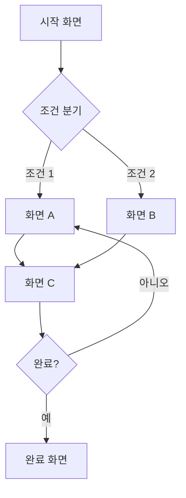

# <% tp.file.cursor(2) %> 화면 흐름도

## 1. 개요

| 항목 | 내용 |
|------|------|
| 흐름도명 | |
| 범위 | |
| 총 화면 수 | |
| 시작 화면 | |
| 종료 화면 | |

> 이 흐름도가 다루는 사용자 여정의 범위를 기술합니다.

---

## 2. 흐름도 범위

### 포함
- [ ]
- [ ]

### 제외
- [ ]

---

## 3. 화면 목록

| 화면 ID | 화면명 | 카테고리 | 상태 |
|---------|--------|---------|------|
| [[SCR-001]] | | | Draft |
| [[SCR-002]] | | | Draft |
| [[SCR-003]] | | | Draft |
| [[SCR-004]] | | | Draft |
| [[SCR-005]] | | | Draft |

---

## 4. 흐름도

---

## 5. 화면 전환 규칙

| From | Action | To | 조건 | 비고 |
|------|--------|----|------|------|
| [[SCR-001]] | 버튼 클릭 | [[SCR-002]] | 로그인 상태 | |
| [[SCR-001]] | 버튼 클릭 | 로그인 | 비로그인 상태 | 리다이렉트 |
| [[SCR-002]] | 항목 선택 | [[SCR-003]] | | |
| [[SCR-003]] | 뒤로가기 | [[SCR-002]] | | |
| [[SCR-003]] | 제출 | [[SCR-004]] | 유효성 통과 | |
| [[SCR-003]] | 제출 | [[SCR-003]] | 유효성 실패 | 에러 표시 |
| [[SCR-004]] | 확인 | [[SCR-001]] | | 홈으로 이동 |

---

## 6. 딥링크 / 외부 진입점

| 진입점 | URL 패턴 | 연결 화면 | 조건 |
|--------|----------|----------|------|
| 푸시 알림 | /items/:id | [[SCR-003]] | 로그인 필수 |
| 이메일 링크 | /verify/:token | 인증 화면 | 토큰 유효 |
| QR 코드 | /qr/:code | [[SCR-002]] | |
| 외부 공유 | /share/:id | [[SCR-003]] | 공개 설정 시 |

---

## 7. 에러/예외 흐름

| 발생 지점 | 에러 상황 | 처리 | 이동 화면 |
|-----------|----------|------|----------|
| 전체 | 네트워크 오류 | 에러 토스트 | 현재 화면 유지 |
| 전체 | 인증 만료 | 로그인 리다이렉트 | 로그인 화면 |
| [[SCR-003]] | 데이터 로드 실패 | 에러 화면 | 에러 화면 |
| [[SCR-003]] | 권한 없음 | 403 화면 | 접근 불가 화면 |

---

## 8. 비고

<!-- 추가 참고사항, 흐름도 변경 이력 등 -->
